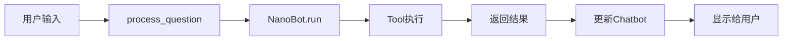

# ChatBI WebUI 架构说明

## 📋 概述

本项目的 WebUI 参考了 qwen-agent 框架的 WebUI 设计模式，结合 NanoBot 框架进行了适配和优化。

## 🔄 与 qwen-agent WebUI 的对比

### 相似之处

1. **类封装设计**
   - qwen-agent: `WebUI` 类
   - 本项目: `ChatBIWebUI` 类
   - 都采用面向对象的设计，将界面逻辑封装在类中

2. **配置化定制**
   ```python
   # qwen-agent
   chatbot_config = {
       'user.name': '',
       'user.avatar': '',
       'agent.avatar': '',
       'input.placeholder': '',
       'prompt.suggestions': []
   }
   
   # 本项目（相同风格）
   chatbot_config = {
       'user.name': '用户',
       'input.placeholder': '请输入您的问题...',
       'prompt.suggestions': [...]
   }
   ```

3. **统一的运行接口**
   ```python
   # qwen-agent
   WebUI(bot, chatbot_config).run()
   
   # 本项目
   ChatBIWebUI(bot, chatbot_config).run()
   ```

4. **推荐对话功能**
   - 两者都支持 `prompt.suggestions` 配置
   - 使用 Gradio 的 Examples 组件展示

5. **流式响应处理**
   - 都支持异步处理
   - 使用 Gradio 的 queue 机制

### 差异之处

| 特性 | qwen-agent WebUI | 本项目 ChatBIWebUI |
|------|------------------|-------------------|
| **Agent 框架** | Qwen-Agent | NanoBot |
| **多 Agent 支持** | ✅ 支持 Agent Hub | ❌ 单 Agent（可扩展） |
| **文件上传** | ✅ 支持图片/音频/视频 | ❌ 暂不支持（可扩展） |
| **工具调用显示** | ✅ 显示工具调用过程 | ⚠️ 简化显示 |
| **头像显示** | ✅ 自动生成头像 | ⚠️ 可选配置 |
| **提及功能** | ✅ @Agent 切换 | ❌ 暂不支持 |
| **复杂度** | 较复杂，功能全面 | 简洁，专注核心功能 |

## 🏗️ 架构设计

### 类结构

```
ChatBIWebUI
├── __init__()          # 初始化配置
├── create_interface()  # 创建 Gradio 界面
├── process_question()  # 处理用户问题（异步）
├── clear_history()     # 清空历史
└── run()               # 启动服务
```

### 核心流程



## ✨ 主要特性

### 1. 配置化设计

```python
chatbot_config = {
    'user.name': '用户',                    # 用户名称
    'user.avatar': '',                      # 用户头像（可选）
    'agent.avatar': '',                     # Agent头像（可选）
    'input.placeholder': '请输入问题...',   # 输入框提示
    'prompt.suggestions': [                 # 推荐问题列表
        '贵州茅台最近一个月的股价走势',
        '预测贵州茅台未来7天的股价',
        ...
    ]
}
```

### 2. 主题定制

```python
theme=gr.themes.Soft(
    primary_hue=gr.themes.utils.colors.blue,
    radius_size=gr.themes.utils.sizes.radius_none,
)
```

### 3. 并发控制

```python
demo.queue(default_concurrency_limit=10)
```

### 4. 会话管理

- 自动维护会话计数器
- 每个请求生成唯一的 session_key
- 支持清空历史记录

## 🚀 使用方法

### 基础用法

```python
from webui import ChatBIWebUI, build_bot

# 初始化 bot
bot = build_bot()

# 配置界面
config = {
    'prompt.suggestions': ['示例问题1', '示例问题2']
}

# 创建并运行
webui = ChatBIWebUI(bot, chatbot_config=config)
webui.run()
```

### 高级配置

```python
# 自定义端口和公开分享
webui.run(
    server_port=8080,
    share=True,  # 生成公网链接
    server_name="0.0.0.0"
)
```

## 📝 扩展建议

### 1. 添加多 Agent 支持

参考 qwen-agent 的 MultiAgentHub，可以扩展为：

```python
class ChatBIWebUI:
    def __init__(self, agents: List[Nanobot], ...):
        self.agent_list = agents
        self.agent_hub = None
```

### 2. 添加工具调用可视化

```python
class ToolCallHook(AgentHook):
    async def before_execute_tools(self, ctx):
        # 显示工具调用信息
        pass
```

### 3. 添加文件上传支持

```python
with gr.Row():
    file_input = gr.File(file_types=['image', 'pdf'])
```

### 4. 添加提及功能

允许用户通过 @ 切换不同的 Agent 或功能模块。

## 🔧 技术细节

### 异步处理

```python
async def process_question(self, question: str, history: List):
    # 异步运行 bot
    result = await self.bot.run(question, session_key=session_key)
    return answer
```

### 错误处理

```python
try:
    result = await self.bot.run(...)
except Exception as e:
    error_msg = f"❌ 发生错误: {str(e)}"
```

### 队列机制

```python
demo.queue(default_concurrency_limit=10).launch(...)
```

## 📊 性能优化建议

1. **启用缓存**: 对常见查询结果进行缓存
2. **限制并发**: 根据服务器性能调整 concurrency_limit
3. **超时控制**: 设置合理的 timeout
4. **资源清理**: 及时关闭数据库连接

## 🎯 最佳实践

1. **配置分离**: 将配置放在 config.json 中
2. **日志记录**: 记录关键操作和错误信息
3. **用户反馈**: 提供清晰的错误提示
4. **文档完善**: 编写详细的使用说明

## 📚 参考资料

- [qwen-agent WebUI 源码](../qwen_agent/gui/web_ui.py)
- [Gradio 官方文档](https://www.gradio.app/docs)
- [NanoBot 文档](https://github.com/nanobot-framework)

---

**版本**: v1.0  
**更新日期**: 2026-04-27  
**作者**: ChatBI 开发团队
